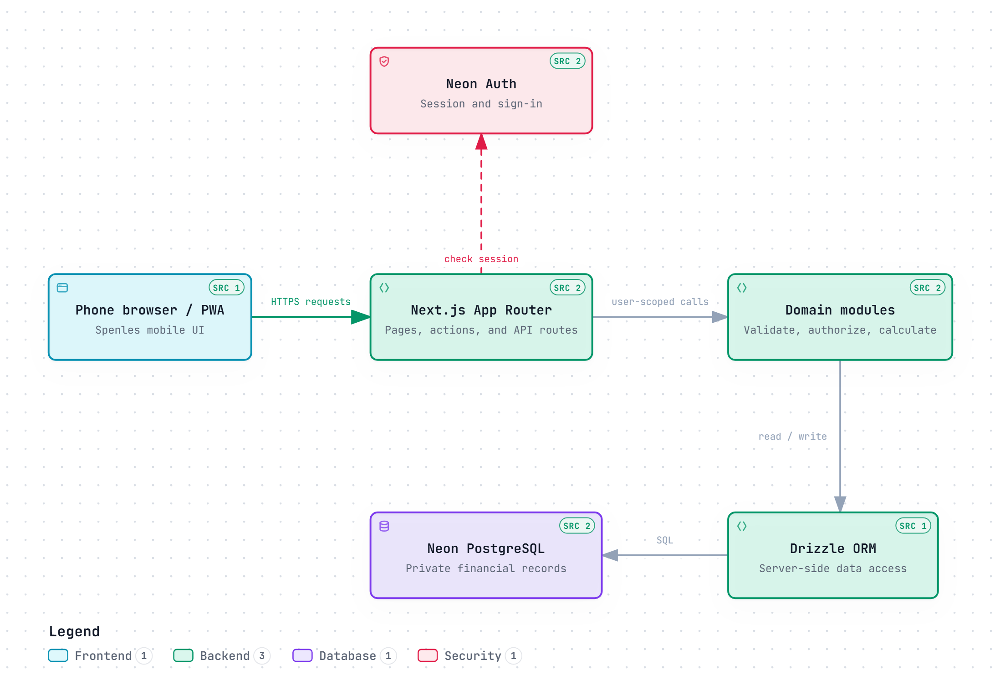

# Spenles

Spenles is a personal finance app for tracking income, expenses, accounts, budgets, and shared bills. It helps you see where your money goes without turning daily tracking into accounting work.

[Try Spenles](https://spenles.vercel.app/) · Designed for phones as an installable web app. On larger screens, the site shows a product overview and phone setup guide.

## What you can do

- Record income and expenses, organize categories, and move money between your own accounts.
- See balances, recent activity, spending trends, and reports for a selected date range.
- Set monthly category budgets and calculate itemized split bills with tax and service charges.
- Download a JSON backup of your personal records.

Spenles tracks money; it does not hold funds or process payments. Amounts are stored as whole Indonesian rupiah (IDR), and each user's records are private.

## Architecture

The app is a Next.js modular monolith. Server actions and routes check the user session before domain code reads or changes records in Neon PostgreSQL.

## Tech stack

| Icon | Technology | Role |
| :---: | --- | --- |
|  | **Next.js + React** | App Router, server rendering, and the PWA |
|  | **TypeScript** | Typed application code |
|  | **Tailwind CSS** | Interface styling; Recharts draws reports |
|  | **Neon PostgreSQL + Drizzle** | Data storage and migrations; Neon Auth handles sign-in |
|  | **Vitest + Playwright** | Unit and browser tests |

## Run locally

You need **Node.js 22**, **npm**, and a **Neon project with PostgreSQL and Neon Auth enabled**. Use credentials from your own Neon project.

1. Install dependencies: `npm ci`.
2. Copy `.env.example` to `.env.local` (`cp .env.example .env.local`; in PowerShell, use `Copy-Item .env.example .env.local`).
3. Set `DATABASE_URL` and `NEON_AUTH_BASE_URL` from Neon. Set `NEON_AUTH_COOKIE_SECRET` to a stable secret of at least 32 characters. Generate one with `node -e "console.log(require('node:crypto').randomBytes(32).toString('hex'))"`. Keep `NEXT_PUBLIC_APP_URL=http://localhost:3000`.
4. Apply the database migrations: `npm run db:migrate`.
5. Start the app: `npm run dev`, then open [localhost:3000](http://localhost:3000) on your laptop. Use the browser's phone preview to see the finance UI.

Use a separate `TEST_DATABASE_URL` only when running integration tests. Never commit `.env.local`.

## Checks

Run `npm run lint`, `npm run typecheck`, `npm run test`, and `npm run build` before shipping changes.
